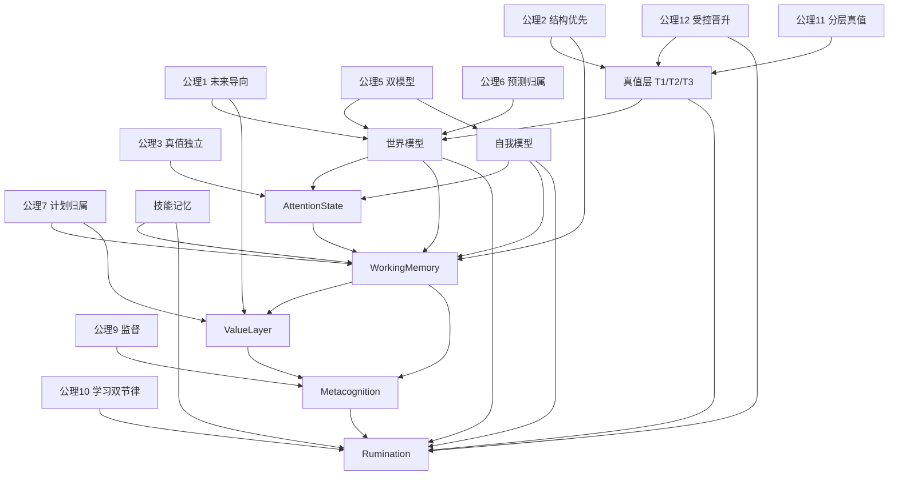

# 0415-公式与公理

> 定位：这是 `0415` 认知理论文档组的浓缩页。  
> 它不承担完整解释任务，而集中给出整套理论中的核心公理、形式定义与主公式，便于快速引用、推导和后续继续形式化。

---

## 1. 总定义

### 定义 1：记忆

> **记忆是认知系统为了服务未来行动，而对过去经验进行结构化保存、持续更新、状态化召回和前台调度的机制。**

这一定义隐含四层要求：

- 记忆服务未来，而非单纯归档过去。
- 记忆的本体是可调用结构，而非原始材料本身。
- 记忆同时具有状态性与过程性。
- 记忆最终必须进入行动回路。

### 定义 2：纯检索系统

> **纯检索系统是原生支持状态输入的 recall engine。**

它负责在不改写真值的前提下，根据当前状态召回最值得进入前台的结构。

### 定义 3：认知系统

> **认知系统是在纯检索系统之上，加入主体、自我状态、前台控制场、价值评估、元认知监督与主动学习回路的整体。**

---

## 2. 基本公理

### 公理 1：未来导向公理

记忆的最终功能不是保存过去，而是服务未来行动。

### 公理 2：结构优先公理

记忆的本体是可再次调用的结构，而不是原始内容。

### 公理 3：真值独立公理

情境、情绪、目标和主体状态只能改变召回优先级，不能直接改写真值。

### 公理 4：前后台分离公理

长期记忆是后台结构，工作记忆是前台控制场；遗忘首先是退出前台，而非物理删除。

### 公理 5：双模型公理

世界模型与自我模型必须分离：

- 世界模型回答“世界是什么样”
- 自我模型回答“我现在如何面对这个世界”

### 公理 6：预测归属公理

预测属于世界模型的内置能力，而不属于行动系统。

### 公理 7：计划归属公理

策略与计划属于行动系统，而不是世界模型。

### 公理 8：技能独立公理

技能记忆必须独立成层，位于世界知识与单次计划之间。

### 公理 9：监督公理

元认知层不仅可调节参数，而且必须拥有独立 veto 权。

### 公理 10：学习双节律公理

主动学习必须分为：

- 短周期止血
- 长周期消化

不能由单一学习节律承担。

### 公理 11：分层真值公理

共享现实与个体认知必须采用 T1/T2/T3 分层结构，而不能用单层真值模型表达。

### 公理 12：受控晋升公理

私有认知进入共享层、共享演化进入本体层，都必须经过受控晋升，而不能自然漂移。

---

## 3. 九层认知架构公理

认知系统由九层构成：

1. 记忆系统
2. 世界模型
3. 自我模型
4. 技能记忆层
5. 注意力系统
6. 工作记忆
7. 行动系统
8. 元认知层
9. 价值 / 偏好 / 规范层

### 总体结构公理

> **后台世界与主体模型通过注意力被带入前台，在工作记忆中形成当前帧与近端分支，由价值层进行多维评估，由元认知进行最终监督，再由行动系统执行并把结果反馈回后台。**

---

## 4. T 层公理

### 定义 4：T 层

`T层` 指真值结构层（Truth Layers），与内容披露层 `L层` 严格区分。

### 定义 5：T1

T1 是共享本体层，表示世界骨架、长期稳定结构与系统级本体约束。

### 定义 6：T2

T2 是共享演化 / 证据层，表示共享现实流、时态事实和可追溯证据。

### 定义 7：T3

T3 是私有认知映射层，表示个体主体的工作假设、局部解释、风险偏置与任务投影。

### 公理 13：T3 合法偏离公理

T3 可以暂时持有与共享层不一致的工作假设，但必须：

- 显式标记
- 可回溯
- 可撤销
- 不得直接覆盖 T1/T2

### 公式 1：T3 → T2 晋升

$$
Promote_{T3 \rightarrow T2}(x)=
Trigger_{result}(x)
\land Verify_{evidence}(x)
\land Validate_{consensus}(x)
\land Approve_{metacog}(x)
$$

语义：

- 结果触发
- 证据复核
- 共识校验
- 元认知放行

四者同时满足，个体认知才有资格进入共享现实层。

### 公式 2：T2 → T1 候选

$$
Candidate_{T2 \rightarrow T1}(x)=
Stable_{time}(x)
\land Reproducible_{agents}(x)
\land Invariant_{contexts}(x)
\land Useful_{prediction}(x)
\land Pass_{structural\_review}(x)
$$

语义：

- 跨时间稳定
- 跨主体复现
- 跨情境不变
- 预测效用显著
- 元认知结构审查通过

---

## 5. 世界模型公理

### 定义 8：世界模型

世界模型是认知系统对外部世界的结构化表征，并内置对状态演化与行动后果的预测能力。

### 公式 3：世界模型抽象

$$
M_W = (S, A, T, O, C)
$$

其中：

- $S$：状态空间
- $A$：动作空间
- $T$：状态转移结构
- $O$：可观测证据
- $C$：约束集合

### 公式 4：反事实预测

$$
Simulate(s_t, a) \rightarrow \hat{s}_{t+1}, \hat{r}, \hat{u}
$$

其中：

- $s_t$：当前状态
- $a$：候选行动
- $\hat{s}_{t+1}$：预测后的下一状态
- $\hat{r}$：预测风险
- $\hat{u}$：预测不确定性变化

### 公理 14：预测开放公理

预测是世界模型的内置能力，但以接口形式向行动系统开放。

---

## 6. 自我模型公理

### 定义 9：自我模型

自我模型是主体当前能力、资源、风险、负载和边界的控制模型。

### 公式 5：自我模型抽象

$$
M_{self} = (B, G, R, F, L)
$$

其中：

- $B$：能力边界
- $G$：当前目标态
- $R$：资源状态
- $F$：失败签名与风险集
- $L$：认知负载

### 公式 6：前台切片

$$
self\_state(t)=Snapshot(M_{self}, t)
$$

### 公式 7：结果驱动更新

$$
M_{self}^{new}=Update(M_{self}^{old}, action\_outcome, metacog\_signal)
$$

### 公理 15：结果驱动公理

自我模型主要由行动结果更新，而不是靠叙述更新。

### 公理 16：侧路调制公理

自我模型不直接进入注意力主向量，而主要通过：

- `Inhibition`
- `MetacogModifier`

影响注意力。

---

## 7. 技能记忆公理

### 定义 10：技能记忆

技能记忆是由多次成功行动轨迹压缩而来的、可跨任务复用的程序性结构。

### 公式 8：技能模板

$$
Skill = (Preconditions, ActionTemplate, ExpectedOutcome, Boundaries)
$$

### 公理 17：技能层位置公理

技能位于策略与单次计划之间，是认知系统中的程序性长期记忆层。

### 公理 18：技能形成公理

技能应主要从成功轨迹中提取，而不是先验手写声明。

---

## 8. 注意力公理

### 定义 11：AttentionState

注意力状态是认知系统中决定什么先进入前台的状态总对象。

### 公式 9：注意力双层状态

$$
AttentionState(t)=Baseline(t)+Delta(task_t, metacog_t)
$$

### 公式 10：Baseline 平滑更新

$$
Baseline(t+1)=Baseline(t)+\eta \cdot (ObservedState-Baseline(t))
$$

### 公式 11：情绪调节

$$
E(c, e, i)=c \odot (1+i \cdot M_e)
$$

### 公式 12：目标偏置

$$
q = E(c,e,i)+\lambda \cdot g
$$

### 公式 13：注意力得分

$$
Score(m)=
cosine\_similarity(q, v_m)
+\alpha \cdot Salience(m)
-\beta \cdot Inhibition(m, self\_model)
+\gamma \cdot GoalAssociation(m, g)
$$

### 公理 19：情绪调节公理

情绪不是普通维度，而是匹配函数调节器。

### 公理 20：优先级不真值公理

状态输入影响召回优先级，但不改写真值。

---

## 9. 工作记忆公理

### 定义 12：工作记忆

工作记忆是注意力输出在当前时刻装配成的临时控制场。

### 公式 14：工作记忆总结构

$$
WorkingMemory(t)=\{
world\_fragments,\;
self\_state,\;
active\_goal,\;
active\_risks,\;
candidate\_actions,\;
metacog\_flags
\}
$$

### 公理 21：当前帧 + 近端分支公理

工作记忆不是纯当前帧，而是：

- 当前帧
- 近端分支

的复合体。

### 公理 22：行动可供性公理

`candidate_actions` 属于工作记忆本体，表示当前前台的行动可供性层。

### 公理 23：三类行动共存公理

工作记忆中的行动候选必须允许三类行动共同竞争：

- 认识性行动
- 操作性行动
- 调控性行动

### 公理 24：整帧替换公理

工作记忆的遗忘机制应是全量刷新，而不是条目级缓慢衰减。

---

## 10. 价值层公理

### 定义 13：价值层

价值层定义“什么算好行动”，其内部结构是固定规则基底加可学习调节层。

### 公式 15：多维价值向量

$$
V(m)=
\big(
v_{goal},
v_{info},
v_{safety},
v_{efficiency},
v_{robustness}
\big)
$$

### 公式 16：线性投影

$$
Score(m)=\sum_i w_i \cdot v_i
$$

### 公式 17：带门槛的投影

$$
Score(m)=
\Big(\prod_i \mathbf{1}[v_i \ge \theta_i]\Big)\cdot \sum_i w_i v_i
$$

### 公式 18：动态权重

$$
W = W_{baseline} + \Delta W_{task} + \Delta W_{self} + \Delta W_{metacog}
$$

### 公理 25：向量后压缩公理

三类行动要公平竞争，价值层必须先保留多维价值向量，再在当前权重配置下压成统一标量。

### 公理 26：硬软分离公理

硬约束不自动学习，软偏好允许慢学习。

---

## 11. 元认知公理

### 定义 14：元认知层

元认知层是对认知过程本身进行监控、调节、暂停与反思的监督机制。

### 公式 19：元认知监督函数

$$
MetaCheck(WM, V, S) \rightarrow (alerts, modifiers, veto)
$$

### 公式 20：veto 条件

$$
Veto = Risk_{hard} \lor Uncertainty_{critical} \lor Boundary_{violated}
$$

### 公理 27：监督器公理

元认知层不是调参器，而是监督器。

### 公理 28：独立 veto 公理

即使某候选行动分数最高，元认知层也可以因高风险或高不确定性而独立否决之。

---

## 12. 反刍公理

### 定义 15：反刍

反刍是认知系统对经验进行主动重组织、重估值和跨层写回的学习过程。

### 公理 29：双节律反刍公理

反刍必须分为：

- 短周期反刍
- 长周期反刍

分别承担即时止血与长期消化。

### 公理 30：双队列公理

反刍必须采用：

- `SPQ`
- `LPQ`

双队列结构，而不能放入同一优先级链中。

### 公理 31：SPQ / LPQ 分工公理

- SPQ 修边界
- LPQ 长结构

### 公理 32：写回契约公理

反刍不是空转推理，而必须以原子、可追溯、带版本控制的方式写回长期结构。

---

## 13. 总结性命题

### 命题 1

> 记忆不是过去的保存器，而是认知系统在价值约束下为未来行动准备世界模型的机制。

### 命题 2

> T3 负责认知试探，T2 负责共享现实，T1 负责世界骨架。

### 命题 3

> 情境决定像不像，自我模型决定能不能用，元认知决定这次该怎么想。

### 命题 4

> 工作记忆是当前帧与近端分支的复合体，是从认知走向行动的最后一公里。

### 命题 5

> 价值层以多维向量保留行动的异质收益，以动态权重投影为统一标量。

### 命题 6

> 反刍是认知系统的主动写回总线：短周期负责止血，长周期负责消化。

---

## 14. 推荐配套阅读

- 总纲： [0415-00记忆认知架构.md](0415-00记忆认知架构.md)
- 真值结构： [0415-真值层.md](0415-真值层.md)
- 世界模型： [0415-世界模型.md](0415-世界模型.md)
- 自我模型： [0415-自我模型.md](0415-自我模型.md)
- 技能记忆： [0415-技能记忆.md](0415-技能记忆.md)
- 注意力： [0415-注意力状态.md](0415-注意力状态.md)
- 工作记忆： [0415-工作记忆.md](0415-工作记忆.md)
- 价值层： [0415-价值层.md](0415-价值层.md)
- 元认知： [0415-元认知层.md](0415-元认知层.md)
- 反刍： [0415-反刍机制.md](0415-反刍机制.md)

---

## 15. 命题依赖图

下面这张图不是实现依赖，而是理论依赖。  
它回答的是：哪些定义和公理是其他结构的前提。

### 15.1 依赖关系的口语化解释

- 如果没有“未来导向”和“结构优先”两条公理，记忆就会退化成归档或搜索，不会长出世界模型、工作记忆和价值层。
- 如果没有“真值独立”公理，注意力系统就会污染世界模型，情绪和目标会直接改写真值。
- 如果没有“双模型”公理，世界模型和自我模型会被混成一个状态容器，主体性和客观性都失去边界。
- 如果没有“预测归属”和“计划归属”两条公理，世界模型与行动系统会互相吞并，系统会在“描述世界”和“选择行动”之间失去分工。
- 如果没有“监督”公理，价值层最高分就会直接变成执行结果，系统将缺少暂停、澄清和 veto 的能力。
- 如果没有“学习双节律”与“受控晋升”，反刍就要么变成事后批处理，要么变成会污染真值的失控自学习。

### 15.2 最小闭环

如果只看最小可运行闭环，那么理论上至少需要这几个元素：

1. `真值结构`
2. `世界模型`
3. `自我模型`
4. `AttentionState`
5. `WorkingMemory`
6. `ValueLayer`
7. `Metacognition`
8. `Action`
9. `Rumination`

去掉其中任何一个，系统都会退化：

- 去掉真值结构，认知没有共享现实基底。
- 去掉自我模型，主体失去边界感。
- 去掉工作记忆，前台无法形成控制场。
- 去掉价值层，三类行动无法公平竞争。
- 去掉元认知，系统缺少监督与刹车。
- 去掉反刍，系统只能运行，不能成长。
